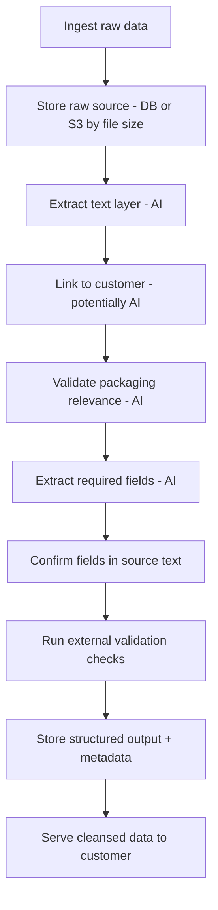

## Packing Prober

A small project to test extraction of packaging information from raw data sources.

## Scope

Raw source documents can be uploaded in many formats (for example, PDF).  
The pipeline uses a mix of AI and traditional code to extract structured packaging data.

## Key Data Requirements

- Material and weight: precise weight (kg) by material type (for example, plastic, paper, glass)
- Packaging type: Primary (consumer-facing), Secondary (bundled), or Tertiary (transit/transport)
- Packaging class: Household or Non-household waste
- Activity: packaging supplied under your own brand, imported, or pack/fill
- Nation of sale: UK nation(s) where packaging was sold

## Data Flow

1. Ingest raw data (for example, a PDF)
2. Store raw source data in persistent storage (database for small files, S3/object storage for larger files)
3. Extract text from the source document (AI-powered)
4. Link the document/data back to a customer (potentially AI-powered)
5. Validate the data (is it actually packaging data?) (AI-powered)
6. Extract required fields (material, weight, packaging type, packaging class, activity, nation of sale) (AI-powered)
7. Confirm extracted values are present in the source text
8. Run external checks (for example, amount ranges and valid material types)
9. Store extracted data in a structured format (for example, CSV or database), including source and extraction metadata
10. Serve cleansed data back to the customer

AI-powered steps are expected to use commercially available models (for example, Claude and Gemini).

